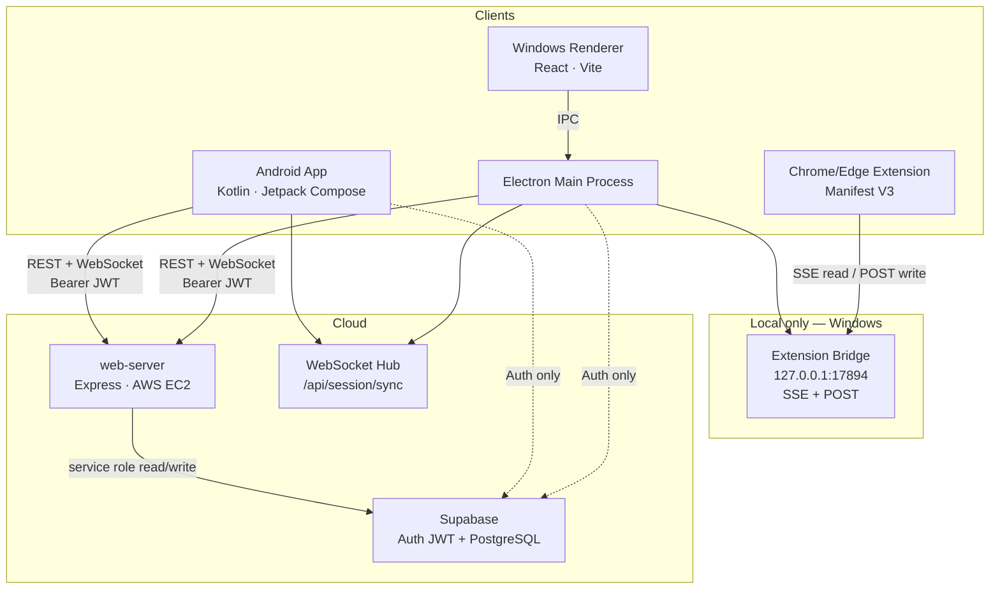
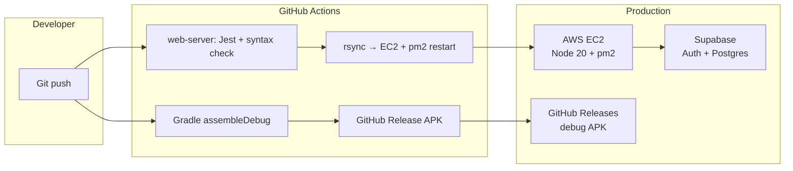
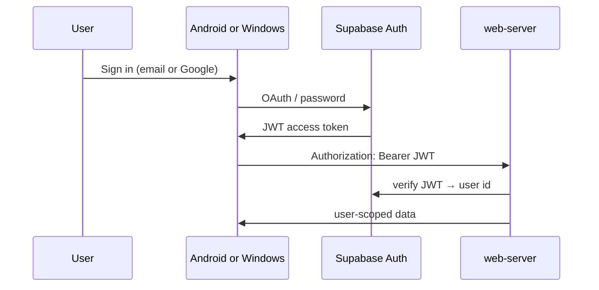
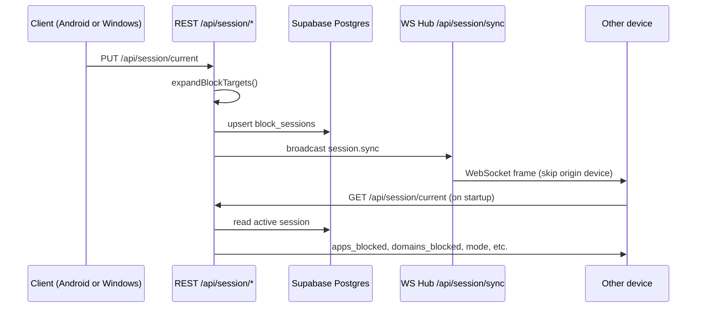
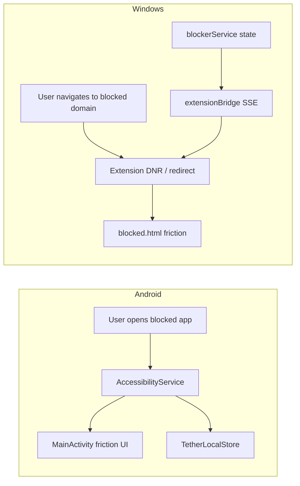
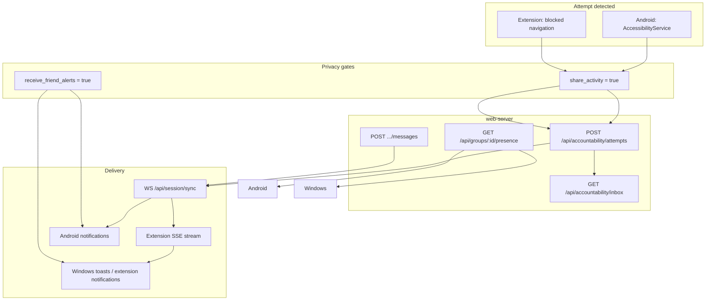

# Tether (DRP-37)

Cross-platform digital wellbeing app that blocks distracting apps and websites, syncs focus sessions across devices, and supports social accountability through leaderboard groups.

## Repository layout

| Path | Role |
| --- | --- |
| [`MyApplication/`](MyApplication/) | Android app — blocks apps via an AccessibilityService |
| [`WindowsApp/`](WindowsApp/) | Windows desktop app — Electron + React; hosts the extension bridge |
| [`WindowsApp/chrome-extension/`](WindowsApp/chrome-extension/) | Chrome/Edge MV3 extension — blocks websites during active sessions |
| [`web-server/`](web-server/) | Node.js/Express API on AWS EC2 — session sync, groups, accountability |
| [`supabase/migrations/`](supabase/migrations/) | PostgreSQL schema migrations (apply in numerical order) |

Sub-project setup guides: [Android](MyApplication/README.md) · [Windows](WindowsApp/README.md) · [Extension](WindowsApp/chrome-extension/README.md) · [Web server](web-server/README.md)

---

## System architecture



**Legend:** solid arrows are application data; dashed arrows are authentication only (Supabase Auth). Clients never call Supabase Postgres directly — all persisted data goes through the web server.

---

## Tech stack

### Android (`MyApplication/`)

| Category | Technology |
| --- | --- |
| Language | Kotlin |
| UI | Jetpack Compose, Material 3 |
| State | `TetherLocalStore` (SharedPreferences) — source of truth for the accessibility service |
| Auth | Supabase Auth (`auth-kt`) — email/password and Google OAuth via `drp37://auth-callback` |
| HTTP / WebSocket | Ktor client (OkHttp) — `WebServerService`, `SessionSyncClient` |
| Blocking | `AppBlockingAccessibilityService` on `TYPE_WINDOW_STATE_CHANGED` |
| Notifications | `AccountabilityNotifier` — attempt alerts, encouragement messages, RemoteInput replies |
| Build | Gradle AGP 9.2, compileSdk 36, minSdk 26 |
| Config | `MyApplication/local.properties` — `SUPABASE_URL`, `SUPABASE_PUBLISHABLE_KEY`, `WEB_SERVER_URL` |

**Key libraries:** Compose BOM, Lifecycle/ViewModel, Ktor (core, android, okhttp, websockets), Supabase BOM + `auth-kt`.

### Windows desktop (`WindowsApp/`)

| Category | Technology |
| --- | --- |
| Shell | Electron 42 |
| UI | React 19, React Router 7, Vite 8 |
| IPC | Main ↔ renderer via [`channels.js`](WindowsApp/src/main/ipc/channels.js) |
| Auth | `@supabase/supabase-js` in main process; Google OAuth callback `http://127.0.0.1:17892/auth/callback` |
| Local HTTP | Extension bridge on `127.0.0.1:17894` — SSE block state and accountability event stream |
| Packaging | electron-builder (NSIS + portable) |
| Config | `WindowsApp/.env` — `VITE_SUPABASE_URL`, `VITE_SUPABASE_PUBLISHABLE_KEY`, `VITE_WEB_SERVER_URL` |

**Key libraries:** electron, react, react-dom, react-router-dom, vite, @supabase/supabase-js, ws, dotenv, electron-builder.

### Chrome/Edge extension (`WindowsApp/chrome-extension/`)

| Category | Technology |
| --- | --- |
| Platform | Manifest V3 service worker |
| APIs | `declarativeNetRequest`, `webNavigation`, `notifications`, `storage`, `alarms` |
| Bridge | Connects to `http://127.0.0.1:17894` for domains, session mode, and friction content |
| UX | `blocked.html` friction page; attempt notifications with preset reply actions |

### Web server (`web-server/`)

| Category | Technology |
| --- | --- |
| Runtime | Node.js ≥ 20 |
| Framework | Express 4 |
| Security | Helmet |
| Auth | `@supabase/supabase-js` — publishable key verifies JWTs; secret key for admin DB access |
| Real-time | `ws` WebSocket hub at `/api/session/sync` |
| Testing | Jest + Supertest |
| Hosting | AWS EC2, managed by PM2 (`drp37-web-server`) |
| Config | `web-server/.env` — `SUPABASE_URL`, `SUPABASE_PUBLISHABLE_KEY`, `SUPABASE_SECRET_KEY`, `PORT`, `HOST` |

**Core modules:** `expandBlockTargets.js`, `blockTargetRegistry.js`, `sessionSyncHub.js`, `accountability.js`, `blockGroups.js`.

### Database (Supabase PostgreSQL)

Migrations live in [`supabase/migrations/`](supabase/migrations/) and must be applied in order (`001` → `010`).

| Table | Purpose |
| --- | --- |
| `auth.users` | Supabase-managed user accounts |
| `block_sessions` | Active and ended focus sessions (apps, domains, canonical targets, mode) |
| `onboarding` | User onboarding preferences (see [Windows README](WindowsApp/README.md) for schema) |
| `focus_session_points` | Points earned per completed session |
| `leaderboard_groups` | Custom and default leaderboard groups |
| `group_members` | Group membership |
| `block_groups` | Saved block-target presets |
| `accountability_preferences` | `share_activity`, `receive_friend_alerts` privacy toggles |
| `accountability_attempts` | Blocked app/site open attempts |
| `accountability_attempt_groups` | Which groups are notified for an attempt |
| `accountability_notifications` | Inbox items for group members |
| `accountability_messages` | Encouragement replies to attempts |

---

## Deploy and CI/CD



| Pipeline | Trigger | Output |
| --- | --- | --- |
| [`.github/workflows/web-server-ci-cd.yml`](.github/workflows/web-server-ci-cd.yml) | Push to `main` (`web-server/**`) | Deploy to EC2 via SSH/rsync, `pm2 restart` |
| [`.github/workflows/android-ci-cd.yml`](.github/workflows/android-ci-cd.yml) | Push to `main`/`master` (`MyApplication/**`) | Debug APK attached to a GitHub Release |

Windows desktop builds are local only: `npm run dist` in `WindowsApp/` produces an NSIS installer or portable executable via electron-builder.

---

## Information flows

### Authentication



| Client | Google redirect URL |
| --- | --- |
| Android | `drp37://auth-callback` |
| Windows | `http://127.0.0.1:17892/auth/callback` |

All API requests carry the Supabase JWT. The web server verifies it via `requireUser` middleware; clients do not query Postgres directly.

### Cross-platform session sync

Clients send platform-native block targets. The server expands them through [`blockTargetRegistry.js`](web-server/src/blockTargetRegistry.js) and stores the cross-platform payload in `block_sessions`.



| Column | Android uses | Windows uses |
| --- | --- | --- |
| `apps_blocked` | AccessibilityService package list | — |
| `domains_blocked` | — | Extension declarativeNetRequest rules |
| `canonical_targets` | Shared IDs (`instagram`, `youtube`, …) | Same |
| `mode` | Friction UI strictness (`breathing`, `reflect`, `hard`) | Extension friction page |

**Write path:** `PUT /api/session/current` starts or ends a session; `PATCH /api/session/current` changes mode.

**Read path:** `GET /api/session/current` restores an in-progress session on startup.

**Real-time path:** WebSocket `/api/session/sync` pushes `session.sync` frames to other devices for the same user. Each client sends a stable `X-Tether-Device-Id` on REST and in its WebSocket `hello` so the hub skips echoing back to the origin device.

WebSocket auth: Android passes `access_token` as a query param; Windows uses the `bearer` WebSocket subprotocol. Invalid tokens close with code `4401`.

### Platform blocking



Android blocks native apps only. Windows blocks websites via the browser extension. `process_tokens` in the block target registry is reserved for future native Windows process blocking.

### Accountability and social features



| Setting | Effect |
| --- | --- |
| `share_activity` | Report block attempts; show active session on group leaderboards/presence |
| `receive_friend_alerts` | Receive attempt and encouragement notifications |

Presence (`GET /api/groups/:groupId/presence`) only returns users who opted in **and** have an active session.

### Windows IPC surface

The Electron renderer never calls Supabase or the web server directly. It goes through IPC channels defined in [`channels.js`](WindowsApp/src/main/ipc/channels.js):

| Channel group | Examples |
| --- | --- |
| Auth | `auth:signIn`, `auth:signInWithGoogle`, `auth:session-update` |
| Web server | `webserver:getCurrentSession`, `webserver:createSession`, `webserver:listGroups` |
| Accountability | `accountability:getInbox`, `accountability:reportAttempt`, `accountability:event` |
| Local session | `session:start`, `session:stop`, `session:remote-sync` |
| Extension | `extension:status` |

---

## REST API (authenticated)

All routes below require `Authorization: Bearer <supabase_jwt>` unless noted.

| Domain | Endpoints |
| --- | --- |
| Health | `GET /`, `GET /health` |
| Onboarding | `GET /api/onboarding`, `PUT /api/onboarding` |
| Sessions | `GET /api/session/current`, `PUT /api/session/current`, `PATCH /api/session/current` |
| Focus points | `POST /api/focus-points`, `GET /api/focus-points/total` |
| Leaderboards | `GET/POST /api/groups`, `POST /api/groups/join`, `POST /api/groups/defaults/sync`, `GET /api/groups/:id/leaderboard`, `GET /api/groups/:id/presence` |
| Block presets | `GET/POST /api/block-groups`, `PUT/DELETE /api/block-groups/:id` |
| Accountability | `GET/PUT /api/accountability/preferences`, `POST /api/accountability/attempts`, `GET /api/accountability/inbox`, read/clear/message endpoints |

WebSocket: upgrade `GET /api/session/sync` on the same host/port as the REST API.

---

## Quick start

### Web server

```sh
cd web-server
npm install
npm run dev    # http://localhost:3000
npm test
```

### Windows app

```sh
cd WindowsApp
npm install
npm run dev    # Vite + Electron
npm test
npm run dist   # build installer
```

Load the extension: Chrome/Edge → Extensions → Developer mode → Load unpacked → `WindowsApp/chrome-extension/`.

### Android app

```sh
cd MyApplication
./gradlew assembleDebug
./gradlew test
```

Add Supabase credentials to `MyApplication/local.properties` (see [Android README](MyApplication/README.md)).

---

## Environment variables

| Location | Variables |
| --- | --- |
| `web-server/.env` | `SUPABASE_URL`, `SUPABASE_PUBLISHABLE_KEY`, `SUPABASE_SECRET_KEY`, `PORT`, `HOST` |
| `WindowsApp/.env` | `VITE_SUPABASE_URL`, `VITE_SUPABASE_PUBLISHABLE_KEY`, `VITE_WEB_SERVER_URL` |
| `MyApplication/local.properties` | `SUPABASE_URL`, `SUPABASE_PUBLISHABLE_KEY`, `WEB_SERVER_URL` |

Never commit secrets. Android and Windows use the Supabase **publishable** key only. The web server alone uses the **secret** key for admin database access.

---

## Adding a blockable target

Edit [`web-server/src/blockTargetRegistry.js`](web-server/src/blockTargetRegistry.js):

```js
registerTarget({
  id: "example",
  packages: ["com.example.android"],
  domains: ["example.com"],
  processTokens: ["example"],
});
```

Omit `packages`, `domains`, or `processTokens` when a target exists on only some platforms.
